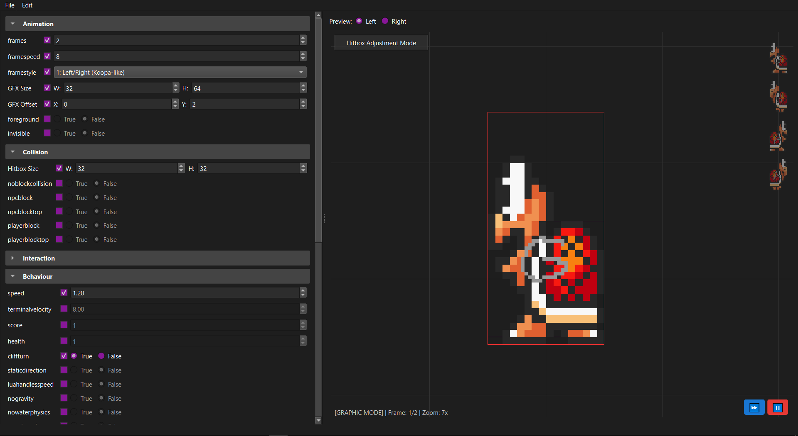

# SMBX Visual NPC Attributes Editor



A specialized GUI tool for editing Super Mario Bros. X (SMBX) NPC configuration files (`.txt`). This tool enables real-time visual editing of sprites and hitboxes, strictly adheres to SMBX file standards, and supports "Hot Reloading" for external edits.

## Features

### ✨ Undo/Redo System
- **Full history tracking**: Keep track of up to 50 actions
- **Keyboard shortcuts**: 
  - `Ctrl+Z` to undo
  - `Ctrl+Shift+Z` (or `Ctrl+Y`) to redo
- **Works with**:
  - Parameter value changes
  - Checkbox enable/disable
  - Visual canvas edits (drag operations)
  - Custom parameter additions/removals
- **Smart merging**: Consecutive edits to the same parameter are merged into one undo step
- **Menu integration**: Undo/Redo actions visible in Edit menu with current action names

### 🎯 Validation Feedback
- **Visual indicators**: Invalid values trigger orange border and background flash
- **Informative tooltips**: Shows exactly why a value was rejected (too small/large, min/max values)
- **Auto-recovery**: Feedback disappears after 2 seconds
- **No silent failures**: You'll always know when your input was clamped or corrected

## Features

- **Interactive Visual Editor**: Real-time canvas for editing graphics and hitboxes with drag-and-drop functionality.
- **Schema-Driven UI**: Dynamically generated interface from a central schema, making it easy to add new parameters.
- **Hot Reload**: Automatically updates when external changes are made to the files.
- **Category Management**: Collapsible sections for organizing parameters, with enable/disable functionality.
- **Custom Properties**: Table for editing unknown or custom parameters without data loss.
- **Tri-State Logic**: Supports explicit values, defaults, and omissions for flexible configuration.
- **Undo/Redo**: Full history tracking with keyboard shortcuts (NEW!)
- **Validation Feedback**: Visual alerts when values are clamped or corrected (NEW!)

## Requirements

- Python 3.8 or higher
- PyQt6

## Installation

1. Clone the repository:
   ```bash
   git clone <repository-url>
   cd SMBX-NPC-GUI-Editor
   ```

2. Install dependencies:
   ```bash
   pip install pyqt6
   ```

## Usage

Run the editor:
```bash
python editor.py
```

### Basic Operations

- **Load file**: `File > Open` or `Ctrl+O`
- **Save file**: `File > Save` or `Ctrl+S`
- **Undo**: `Edit > Undo` or `Ctrl+Z`
- **Redo**: `Edit > Redo` or `Ctrl+Shift+Z`

### Visual Editing

- Use the visual canvas to edit graphics (red box) and hitboxes (green box)
- Click "Hitbox Adjustment Mode" to switch between editing modes
- **Left-click and drag**: Resize or move the active box
- **Right-click and drag**: Pan the view
- **Mouse wheel**: Zoom in/out

### Parameter Editing

- Adjust parameters in the collapsible categories on the right
- Check the checkbox next to a parameter to enable it
- Uncheck to use the default value (parameter won't be written to file)
- Changes are tracked in the undo history

### Keyboard Shortcuts

| Action | Shortcut |
|--------|----------|
| Open File | `Ctrl+O` |
| Save File | `Ctrl+S` |
| Undo | `Ctrl+Z` |
| Redo | `Ctrl+Shift+Z` or `Ctrl+Y` |
| Quit | `Ctrl+Q` |

## Architecture

**Tech Stack:** Python 3, PyQt6  
**Architecture:** Schema-Driven MVC (Model-View-Controller)

**Project Goal:**  
To create a specialized GUI tool for editing Super Mario Bros. X (SMBX) NPC configuration files (`.txt`). The tool enables real-time visual editing of sprites and hitboxes, strictly adheres to SMBX file standards, and supports "Hot Reloading" for external edits.

### Core Architectural Concepts

1. **Schema-Driven UI (`npc_definitions.py`):**
   - The UI is **not hardcoded**. It is generated dynamically from a central dictionary (`NPC_DEFS`).
   - This schema defines every parameter's **Type** (int, float, bool, enum), **Default Value**, **Category** (Animation, Physics, etc.), and **Constraints**.
   - Adding a new SMBX parameter requires only a single line change in the definition file.

2. **Smart Data Model (`npc_data.py`):**
   - **Tri-State Logic:** Parameters can be:
     - `Value`: Explicitly set (e.g., `true`, `10`).
     - `None`: Omitted/Default. These are **not written** to the save file.
   - **Preservation:** Uses a "Read-Modify-Write" strategy. It reads the original file line-by-line to preserve comments, formatting, and custom Lua variables (`custom_params`), only injecting/updating standard parameters where necessary.

3. **Undo/Redo System (`undo_commands.py`):**
   - Implements Qt's `QUndoCommand` pattern
   - Each action creates a command object that can be undone/redone
   - Commands are pushed to a `QUndoStack` which manages history
   - Smart command merging for consecutive edits

4. **Validated Widgets (`validated_widgets.py`):**
   - Custom `QSpinBox` and `QDoubleSpinBox` subclasses
   - Detect when values are clamped to min/max ranges
   - Show visual feedback (orange border, tooltip) for 2 seconds
   - Prevent silent value corrections

### Key Features

- **Interactive Visual Editor (Canvas):**
  - **Rendering:** Simulates SMBX animation speed (`framespeed`) and Frame Styles (0=Standard, 1=Left/Right, 2=4-Way). Correctly handles visual flipping and offset inversion for different facing directions.
  - **Direct Manipulation:**
    - **Graphic Mode:** Drag Red Box edges to resize graphics; drag center to move offsets.
    - **Hitbox Mode:** Toggle HUD button to resize the Green Collision Box.
  - **Sync:** Visual changes immediately update the UI SpinBoxes via `dataChanged` signals.
  - **Hot Reload:** Monitors the loaded `.txt` and `.png` files. If they are changed externally (e.g., by Aseprite or Notepad), the editor automatically updates without restarting.

- **User Interface:**
  - **Dual-Column Layout:** Automatically detects pairs (Width/Height, X/Y) and renders them side-by-side.
  - **Tri-State Booleans:** Custom radio widgets allow explicit `True`, `False (Forced)`, or `Default` (None) selection.
  - **Custom Properties Table:** A generic table to view and edit unknown keys found in the file (e.g., specific AI variables), ensuring data is never lost.

## Code Structure

1. **`editor.py`:** Root entry point. Sets up the package path and theme.
2. **`program/npc_definitions.py`:** The Master Schema containing the dictionary of all supported SMBX parameters.
3. **`program/npc_data.py`:** Handles File I/O, parsing logic, and state management (Standard vs. Custom params).
4. **`program/editor_window.py`:** Generates the UI based on the schema. Handles the logic for Collapsible Categories, file watching, undo/redo, and syncing inputs.
5. **`program/preview_widget.py`:** The `QWidget` canvas. Handles painting, mouse event logic (drag/pan/zoom), coordinate translation, and animation timers.
6. **`program/undo_commands.py`:** (NEW) Implements `QUndoCommand` subclasses for all undoable actions.
7. **`program/validated_widgets.py`:** (NEW) Custom widgets with validation feedback.

## Tips for Best Results

### Validation Feedback
- When you see the orange border flash, check the tooltip to understand the constraint
- The editor will never allow invalid values - it automatically corrects them
- Use the status bar at the bottom to see recent actions and undo history

### Undo/Redo Best Practices
- Visual drag operations are recorded as a single undo step when you release the mouse
- Rapidly changing a spinbox value creates one merged undo step
- The undo limit is 50 actions - older history is automatically pruned
- Loading a new file clears the undo history

### External Editing
- The editor detects changes made by external programs (Aseprite, text editors, etc.)
- When reloading, the undo history is preserved
- This allows seamless workflows: edit sprite in Aseprite, adjust parameters in editor

## Troubleshooting

### Validation Issues
- **Problem**: Value keeps changing when I type
- **Solution**: You're entering a value outside the allowed range. Check the tooltip for min/max values.

### Undo/Redo Issues
- **Problem**: Undo doesn't work
- **Solution**: Make sure you've made changes after loading the file. Loading a file clears undo history.

- **Problem**: Too many undo steps
- **Solution**: The limit is 50 actions. Older actions are automatically removed.

## License

MIT License - see [LICENSE](LICENSE) for details.
